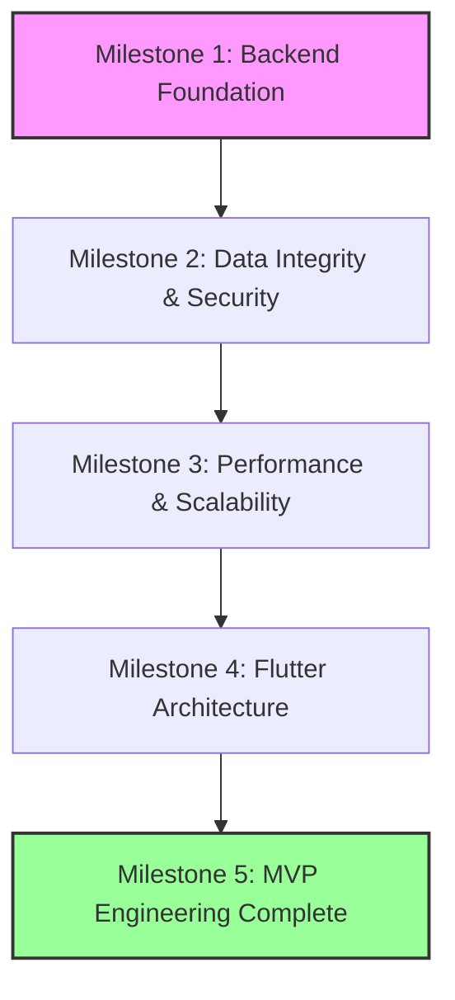

# ConstructPulse Implementation Milestones

This document establishes measurable, outcome-driven milestones for the ConstructPulse engineering implementation phase. These milestones track systemic architectural achievements rather than the granular completion of individual engineering decisions.

---

## Milestone 1: Backend Foundation Complete

**Purpose:** To stabilize the core backend architecture by enforcing strict architectural boundaries and ensuring all database transactions operate atomically.

**Included Workstreams:**
- Workstream 1: Backend Foundation

**Included Engineering Decisions:**
- EDR-001: Service Layer Refactoring
- EDR-003: Transaction Boundaries & Unit of Work
- EDR-010: Architectural Boundary Enforcement
- EDR-021: Exception Handling Standardization

**Definition of Done:**
- All `db.commit()` and `db.rollback()` calls have been removed from the router layer. Services now own business transactions and perform at most ONE explicit commit per operation.
- All cross-domain module imports have been refactored to use explicit feature boundaries.
- The global exception handler intercepts and formats all custom typed exceptions.

**Exit Criteria:**
- The backend test suite executes 100% successfully without database deadlocks.
- Code review confirms zero transaction commits occurring outside of designated boundaries.

**Risks Eliminated:**
- Severe data corruption and partial database writes during concurrent requests.
- "Spaghetti code" resulting from circular module dependencies.

**Business Value:**
- Provides a stable, predictable foundation that ensures future feature development will not cause catastrophic database state errors.

**Expected Deliverables:**
- Refactored FastAPI dependency injection pipeline.
- Clean `app/services` directory containing only business logic.

---

## Milestone 2: Data Integrity & Security Complete

**Purpose:** To secure the platform against unauthorized access, malicious traffic, and concurrency-driven data duplication.

**Included Workstreams:**
- Workstream 2: Concurrency & Data Integrity
- Workstream 3: Authorization & Security

**Included Engineering Decisions:**
- EDR-005: TOCTOU Registration Fixes
- EDR-006: Optimistic Concurrency Control
- EDR-007: Idempotent State Transitions
- EDR-022: RBAC Migration
- EDR-023: Permission Matrix Finalization
- EDR-024: Session Reliability
- *Future Improvements:* Rate Limiting, Dynamic CORS

**Definition of Done:**
- Unique constraints and `version_id` columns are successfully migrated into the PostgreSQL database.
- The legacy `RoleChecker` is fully removed, and every endpoint relies exclusively on the finalized `PermissionChecker`.
- API Rate Limiting is active and globally enforced.
- The Flutter application successfully intercepts and gracefully handles JWT expiration.

**Exit Criteria:**
- Load testing demonstrates that concurrent duplicate requests are cleanly rejected by the database.
- Security testing confirms unauthorized roles receive HTTP 403 Forbidden on restricted endpoints.

**Risks Eliminated:**
- Denial of Service (DoS) vulnerability.
- Unauthorized data access and cross-tenant leakage.
- Duplicate user registration and overlapping attendance check-ins.

**Business Value:**
- Ensures the platform meets strict enterprise compliance and security standards, a non-negotiable requirement for construction workforce management.

**Expected Deliverables:**
- Database migration scripts (Alembic).
- Complete, active RBAC matrix documentation.
- Functional `slowapi` integration.

---

## Milestone 3: Performance & Scalability Complete

**Purpose:** To optimize data retrieval and network payloads, ensuring the platform remains highly performant as the enterprise user base scales.

**Included Workstreams:**
- Workstream 4: Performance & Scalability

**Included Engineering Decisions:**
- EDR-025: Eliminating N+1 Queries
- EDR-027: Eliminating Client-Side Filtering

**Definition of Done:**
- All heavy relational endpoints use explicit `joinedload` or `selectinload` SQLAlchemy configurations.
- All list-based REST endpoints implement server-side pagination (offset/limit or cursor).
- The Flutter application no longer downloads complete datasets for client-side filtering; Riverpod providers consume paginated APIs.

**Exit Criteria:**
- APM (Application Performance Monitoring) confirms zero N+1 query patterns triggered during endpoint execution.
- Network payload sizes for list endpoints are strictly bounded regardless of total database table size.

**Risks Eliminated:**
- Database CPU/Memory exhaustion during large serialization loops.
- Client-side out-of-memory (OOM) crashes on older mobile devices.

**Business Value:**
- Drastically reduces server hosting costs and guarantees a fast, fluid user experience for mobile field workers on low-bandwidth connections.

**Expected Deliverables:**
- Refactored SQLAlchemy repository queries.
- Updated REST API schemas (Pydantic pagination models).
- Refactored Riverpod list providers.

---

## Milestone 4: Flutter Architecture Complete

**Purpose:** To elevate the mobile user interface to enterprise standards, ensuring responsive layouts across devices and providing consistent interaction feedback.

**Included Workstreams:**
- Workstream 5: Flutter Architecture
- Workstream 6: Developer Experience & Documentation

**Included Engineering Decisions:**
- EDR-011: Live UI Refresh
- EDR-016: Responsive Tablet Layouts
- EDR-017: Material Touch Feedback
- EDR-029: Developer Onboarding Improvements
- *Future Improvements:* Standardized UI Fallbacks

**Definition of Done:**
- The global layout builder appropriately adjusts UI structures for tablet form factors.
- All interactive buttons and cards implement Material `InkWell` touch ripples.
- Timer duration strings update automatically without requiring manual screen refreshes.
- Firebase documentation is published in the repository.

**Exit Criteria:**
- Manual UI testing on both phone and tablet emulators confirms proper adaptive rendering.

**Risks Eliminated:**
- Poor user adoption due to a stagnant, unresponsive, or confusing mobile interface.

**Business Value:**
- Secures enterprise adoption by providing site managers with an optimized tablet experience for managing workforce attendance and safety.

**Expected Deliverables:**
- Flutter `LayoutBuilder` wrapper components.
- Standardized UI components (`EmptyState`, `ErrorState`) applied globally.

---

## Milestone 5: MVP Engineering Complete

**Purpose:** The final aggregation of all structural remediation and technical debt cleanup mandated by the Engineering Decision Verification phase.

**Summary of Completed Work:**
At this milestone, all 16 `Improve Before MVP` Engineering Decisions have been successfully implemented, reviewed, and merged. The backend foundation is transactionally safe and secure. The database is protected against concurrent data corruption. The API is rate-limited, paginated, and optimized. The Flutter frontend consumes data efficiently and renders responsively across devices.

**Expected Engineering Maturity:**
The platform has transitioned from a fragile proof-of-concept into a stable, scalable, enterprise-ready software system. The architectural risk profile has been reduced from Critical to Low.

---

## Milestone Dependency Diagram

*Note: While development of individual tasks within M2 and M3 may slightly overlap, the formal completion of each milestone strictly blocks the start of the subsequent milestone.*

---

## Engineering Completion Criteria

ConstructPulse reaches specific stages of maturity based on strict criteria:

**Engineering Complete**
Achieved when:
- All four implementation milestones (M1 through M4) have met their respective Exit Criteria.
- All code associated with the 16 `Improve Before MVP` EDRs has been merged into the `main` branch.

**MVP Ready**
Achieved when:
- The project is "Engineering Complete."
- Automated CI/CD pipelines successfully build and deploy both the backend API and the Flutter application.
- Initial QA integration testing confirms that the critical path (User Login -> Site Selection -> Worker Check-In) functions without error.

**Ready for Feature Development**
Achieved when:
- The project is "MVP Ready."
- The `IMPLEMENTATION_WORKSTREAMS.md` backlog is completely clear of foundational refactoring tasks.
- At this point, the engineering team may safely pivot to building new features (such as the postponed Asset Management module) without risking the stability of the core platform.
